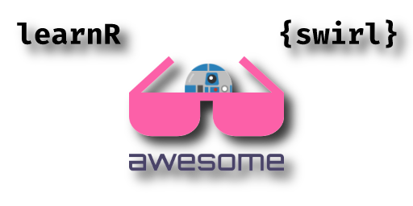

# Awesome LearnRwithR 

A curated list of learnR and {swirl} related resources. LearnR and {swirl} are R-Packages for learning R in R, but not only limited to the R Language.

In the first part you find links to source code, documentation & community of the packages itself. In the second part we list courses made with learnR or {swirl}. A third part list further resources for learning R.

You're welcome to add new stuff or report glitches. See [contributing.md](contributing.md) how to pull requests.  

## Table of Content
* [R-Package Links](#R-Package-Links)
  * [LearnR Stuff](#LearnR-Stuff)
  * [Swirl Stuff](#Swirl-Stuff)

* [Tutorials Guides & Courses](#Tutorials-Guides--Courses)
  * [Made with LearnR](#Made-with-LearnR)
  * [Made with Swirl](#Made-with-Swirl)  

* [Further Resources](#Further-Resources)
  

---
 
## Content
### R-Package Links
#### LearnR Stuff
##### Official Links
- [github-page](https://rstudio.github.io/learnr/) - Official Homepage of the Package. 
- [github-repo](https://github.com/rstudio/learnr) - Official github repository. 
##### References
- [CRAN](https://cran.r-project.org/package=learnr) - CRAN canonical URL.
- [rdocumentation.org](https://www.rdocumentation.org/packages/learnr) - Package Documentation. 
- [libraries.io](https://libraries.io/cran/learnr) - Page on Libraries.io.
- [rdrr.io](https://rdrr.io/cran/learnr/) - Page on rdrr.io.

#### Swirl Stuff
##### Official Links
- [swirlstats.com](https://swirlstats.com/) - Official Homepage of the Package. 
- [github-repo for package](https://github.com/swirldev/swirl) - Official github repository for the package.  
- [github-repo for swirlify](https://github.com/swirldev/swirlify) - Toolbox for writing swirl courses.
- [github-repo for courses](https://github.com/swirldev/swirl_courses) - Official github repository for the courses, see also  [Made with Swirl](#Made-with-Swirl).
##### References
- [rdocumentation.org](https://www.rdocumentation.org/packages/swirl/) - Package Documentation. 
- [CRAN](https://CRAN.R-project.org/package=swirl) - CRAN canonical URL.
- [libraries.io](https://libraries.io/cran/swirl/) - Page on Libraries.io.
- [rdrr.io](https://rdrr.io/cran/swirl/) - Page on rdrr.io.
##### Community
- [twitter](https://twitter.com/swirlstats) - Twitter Account.
- [google.group](https://groups.google.com/forum/#!forum/swirl-discuss) - Discussion Group.

  
### Tutorials Guides & Courses
#### Made with LearnR
##### Examples by RStudio
- [Setting Up R](https://jjallaire.shinyapps.io/learnr-tutorial-00-setup/) - Set up your computer to use R, *JJ Allaire*. 
- [Data Basics](https://jjallaire.shinyapps.io/learnr-tutorial-01-data-basics) - Learn how to look at data with R, *JJ Allaire*.
- [Filtering Observations](https://jjallaire.shinyapps.io/learnr-tutorial-03a-data-manip-filter/) - Learn how to filter your data, *JJ Allaire*.  
- [Sumarizing Data](https://jjallaire.shinyapps.io/learnr-tutorial-03c-data-manip-summarise/) - Learn how to summarise a table of data, *JJ Allaire*.  
- [Creating New Variables](https://jjallaire.shinyapps.io/learnr-tutorial-03b-data-manip-mutate/) - Learn how to derive new variables from a data frame, *JJ Allaire*. 

##### Online Courses
- [vegawidget Overview](https://ijlyttle.shinyapps.io/vegawidget-overview/) - Learn vegawidgets, *Ian Lyttle*.
- [Data Literacy](https://tladeras.shinyapps.io/dataLiteracy/) - Understanding Visualizations, *Ted Laderas*.
- [OHSU Tutorial](https://minnier.shinyapps.io/ODSI_continuousData/) Tutorial for OHSU Data Science Institute, see also [github](https://github.com/laderast/DSIExplore) - *Ted Laderas* and *Jessica Minnier*. 
- [Tidyeval](https://ijlyttle.shinyapps.io/tidyeval/) - by *Ian Lyttle*.

##### Courses as package
- [learningAnalytics](https://bradleyboehmke.github.io/learningAnalytics/) - Tutorials covering various statistical techniques by *Brad Boehmke*.  
    1. “Hello”: An introduction to learningAnalytics
    2. “EDA”: Exploratory Data Analysis
    3. “Unsupervised”: Principal Components Analysis & Cluster Analysis
    4. “Linear Regression”: Linear Regression
    5. “Supervised Classification”: Logistic Regression & Discriminant Analysis
    6. “Resampling”: Leave-One-Out Cross-Validation, k-Fold Cross Validation, & Bootstrapping
    7. “Model Selection”: Best Subset & Stepwise Selection for Linear Models
- [trainR](https://trainr.rsquaredacademy.com/) - Interactive R Tutorials by *Aravind Hebbali*.
    1. data-wrangling-with-dplyr-part-1
    2. data-wrangling-with-dplyr-part-2
    3. data-wrangling-with-dplyr-part-3
    4. hacking-strings-with-stringr
    5. import-data-in-r-part-1
    6. import-data-in-r-part-2
    7. introduction-to-tibbles
    8. readable-code-with-pipes
    9. work-with-date-and-time-in-R
    10. working-with-categorical-data
- [rexercises](https://github.com/nlhuong/rexercises) - R-Exercises by *Lan Huong Nguyen*.
    1. data_to_R
    2. vectors_and_matrices
    3. lists_and_data_frames
    4. programming
    5. plotting
- [RKurs](https://github.com/strengejacke/RKurs) - German R Exercises by  *Daniel Lüdecke*. 
- [YARD](https://github.com/pegeler/YARD) - Yet Another R Demo by *Paul Egeler*.
- [adventr](https://github.com/profandyfield/adventr) - An Adventure in Statistics by *Andy Field*, see also [Book-Page](https://www.discoveringstatistics.com/books/an-adventure-in-statistics/).  
    1. Why you need science
    2. Reporting research, variables and measurement
    3. Summarizing Data
    4. Fitting models (central tendency)
    5. Presenting data
    6. z-scores
    7. Probability
    8. Inferential statistics
    9. Robust estimation
    10. Hypothesis testing
    11. Modern approaches to theory testing
    12. Assumptions
    13. Relationships
    14. The general linear model
    15. comparing two means
    16. Comparing several means
    17. Factorial designs

#### Made with Swirl
- [Advanced R](https://swirlstats.com/scn/arp.html) - Advanced R Programming by *Roger Peng*
- [ConoceR](https://swirlstats.com/scn/conocer.html) - (es) ConoceR by *David Duncan*
- [DataScience](https://swirlstats.com/scn/dsandr.html) - Data Science and R by *Wush Wu*
- [EDA](https://swirlstats.com/scn/eda.html) - Exploratory Data Analysis by *Team swirl*
- [GetCleanData](https://swirlstats.com/scn/getclean.html) - Getting and Cleaning Data by *Team swirl*
- [Google Forms](https://swirlstats.com/scn/gfc.html) - Google Forms Course by *Sean Kross*
- [Estadistica](https://swirlstats.com/scn/estadistica.html) - (es) Programacion Estadistica R by *Ismael Fernández*
- [Programando en R](https://swirlstats.com/scn/programando.html) - (es) Programando en R by *José R Sosa*
- [Psychology Statistics](https://swirlstats.com/scn/Psychology_Statistics.html) - Psychology Statistics by *Kevin R. Carriere*
- [QSS](https://swirlstats.com/scn/qss.html) - qss-swirl by *Kosuke Imai*
- [R Programming](https://swirlstats.com/scn/rprog.html) - R Programming by *Team swirl*
- [R Programmieren](https://swirlstats.com/scn/R_Programmieren.html) - (de) R Programmieren by *Stephan Weibelzahl*
- [R Environment](https://swirlstats.com/scn/rpe.html) - The R Programming Environment by *Roger Peng*
- [RegEx](https://swirlstats.com/scn/regular_expressions.html) - Regular Expressions by *Jon Calder*
- [RegModel](https://swirlstats.com/scn/regmod.html) - Regression Models by *Team swirl*
- [Inference](https://swirlstats.com/scn/statinf.html) - Statistical Inference by *Team swirl*
- [Short Introduction](https://swirlstats.com/scn/A_(very)_short_introduction_to_R.html) - A (Very) Short Introduction to R by *Claudia Brauer*

### Further Resources
- [Awesome R](https://awesome-r.com/)  
- [R Data Science Tutorials](https://github.com/ujjwalkarn/DataScienceR)  
- [makemeanalyst](http://makemeanalyst.com/)  
- [cheatsheets](https://www.rstudio.com/resources/cheatsheets/) 

